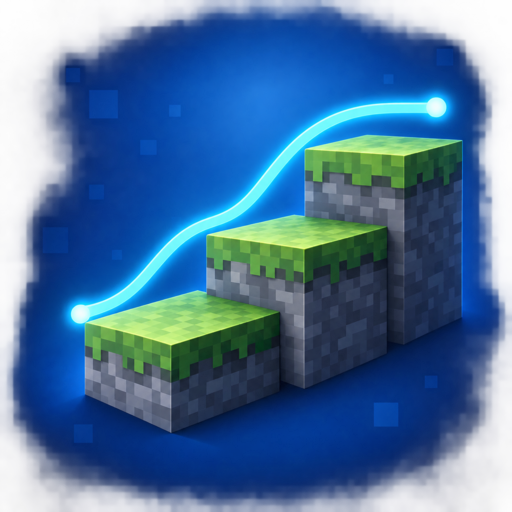

# Smart StepUp Camera Smoother

<p align="center">
  
</p>

Smart StepUp Camera Smoother is a client-only mod for Minecraft Java Edition, with Fabric and NeoForge builds for all released 26.x versions through 26.3, plus 1.21.11 and 1.21.1. It softens the camera movement caused when collision handling steps the player onto a higher surface.

The original 26.2 implementation was designed around [StepItUp 3.0](https://modrinth.com/mod/stepitup/version/3.0-26.2-fabric), including its 1.25-block step height, while remaining useful for vanilla stairs, slabs, snow layers, and other mods that change the effective step height.

> **Version matrix (0.3.1):** Fabric and NeoForge builds for Minecraft **26.1, 26.1.1, 26.1.2, 26.2, 26.3, 1.21.11, and 1.21.1**. See [builds and validation](docs/VERSION_MATRIX.md). Minecraft 26.x needs Java 25; 1.21.x needs Java 21. Install only the JAR matching your Minecraft version and loader.

> Requested maintainer gameplay testing is complete; individual results are recorded in [the version matrix](docs/VERSION_MATRIX.md). Release 0.3.1 updates the defaults to **150% Smoothness / Third Person Off**, with automated unit, real-client, mouse-input, and packaging checks for every build. Existing saved preferences are preserved.

> Previous Fabric release build: 0.2.0 for Minecraft 26.3 on Fabric. Maintainer gameplay testing passed on September 18, 2026. The previous release is 0.1.0 for 26.2. See [26.3 validation](docs/MINECRAFT_26_3.md).

## What it does

- Detects the local player's resolved upward collision step instead of guessing from block types.
- Applies a render-only world-Y camera offset. Player position, hitbox, reach, physics, and network packets are unchanged.
- Cancels the initial one-tick vertical snap, then eases the camera to the new height.
- Handles consecutive steps by adding short-lived transitions with a bounded total lag.
- Smooths first-person steps by default, with optional rear and front third-person smoothing.
- Resets immediately for jumps, swimming, ladders, flight, elytra, vehicles, spectator mode, death, respawn, world changes, and non-player movement sources.
- Requires no configuration library, Architectury API, or direct StepItUp dependency. Mod Menu support is optional.

This project is a distinct clean implementation. It does not contain code, assets, or binaries from StepItUp or Countered's Smooth Steps.

## Compatibility

| Component | Supported version | Relationship |
|---|---:|---|
| Minecraft Java Edition | 26.3 | Required |
| Fabric Loader | 0.19.5 or newer within the 26.3 line | Required and tested |
| Java | 25 or newer | Required |
| StepItUp | No verified 26.3 build available | Optional; compatibility pending |
| Mod Menu | 21.0.0-beta.1 | Optional configuration screen |
| Fabric API | 0.160.7+26.3 | Development test fixture plus StepItUp and Mod Menu dependency |
| Text Placeholder API | 3.2.0+26.3 | Mod Menu dependency |

Do not install another camera step-smoothing mod at the same time. Two mods applying the same visual correction can overcompensate.

See [Compatibility](docs/COMPATIBILITY.md) for the exact fixture and known boundaries.

## Installation

1. Install Fabric Loader for Minecraft 26.3.
2. Put the verified `smart-stepup-camera-smoother-<version>.jar` in the instance `mods` folder.
3. Optionally install Mod Menu 21.0.0-beta.1, Fabric API, and Text Placeholder API to configure smoothness in game. A dependency-aware launcher normally installs the latter two automatically.
4. For full-block stepping tests, enable cheats and use `/attribute @s minecraft:step_height base set 1.25`. StepItUp compatibility on 26.3 is pending a compatible upstream release.
5. Start Minecraft once to create `config/stepup-camera-smoother.json`.

The public rename does not change the internal mod ID `stepup_camera_smoother`, Java packages, resource namespace, or `config/stepup-camera-smoother.json`. Existing alpha installations upgrade in place and retain their configuration.

## CurseForge publishing

The canonical project icon is [`src/main/resources/assets/stepup_camera_smoother/icon.png`](src/main/resources/assets/stepup_camera_smoother/icon.png). It is an original 512 by 512 PNG, is registered in `fabric.mod.json`, and is packaged inside the jar so Fabric and compatible mod lists can display it.

CurseForge does not copy the icon out of the jar. Upload the same PNG separately as the project logo when creating the CurseForge page. Successful CI artifacts include a standalone copy named `smart-stepup-camera-smoother-icon-512.png` beside the playable jar and checksum.

## Configuration

With Mod Menu installed, open **Mods**, select **Smart StepUp Camera Smoother**, and open its configuration screen. The **Smoothness** slider ranges from 0% to 200%:

- 0% leaves the original upward camera motion unchanged.
- 50% smooths half of each upward camera snap.
- 100% applies full smoothing.
- 150% is the default; it keeps full correction and extends the recovery to 1.5 times its configured duration.
- 200% keeps full correction and extends the recovery to twice its configured duration.

The **Third Person** control enables or disables smoothing in both rear and front third-person views. Select **Done** to save and apply both values immediately. The current camera transition is cleared so the next eligible step uses the new settings. **Cancel** or Escape discards changes made on the screen. Third-person smoothing is off by default. **Reset** restores 150% Smoothness and disables third-person smoothing without changing the other JSON settings.

Mod Menu is an optional integration, not a dependency required to start or use the mod. Smart StepUp Camera Smoother does not use Cloth Config.

The generated file is `config/stepup-camera-smoother.json`:

```json
{
  "config_version": 1,
  "enabled": true,
  "recovery_duration_ms": 180,
  "easing": "smootherstep",
  "smoothing_strength": 1.5,
  "maximum_camera_lag": 2.5,
  "smooth_third_person": false,
  "debug_logging": false
}
```

The GUI slider stores `smoothing_strength` as a value from `0.0` to `2.0`. Values through `1.0` control how much of the step snap is corrected. Values above `1.0` retain full correction and multiply the recovery duration, up to twice the configured duration at `2.0`. Changes saved through Mod Menu take effect immediately. Restart the client after editing the JSON file manually.

Versionless alpha.2 configurations are migrated once to `config_version: 1`, preserving explicitly saved preferences. Missing settings use the current defaults. A configuration from a newer unsupported version is left untouched and safe defaults are used for that launch.

Valid easing values are `linear`, `smoothstep`, `smootherstep`, and `exponential`. Values are clamped to safe ranges during loading. A malformed file is not overwritten and safe defaults are used for that launch.

## How it works

StepItUp changes the local player's effective step height before vanilla movement. It does not provide a camera API. This mod therefore observes `LocalPlayer.move` before and after vanilla collision resolution.

An event qualifies only when a grounded, eligible player moves horizontally and the resolved vertical rise is greater than the requested vertical motion but no higher than `player.maxUpStep()` plus a small collision tolerance. Ordinary jumps and teleports do not meet those conditions.

The camera correction runs in Minecraft 26.3's `Camera.alignWithEntity(float)` method after the perspective state is selected. Using `setPosition` keeps the camera's internal block position synchronized. In third person, vanilla then calculates camera distance and wall collision from the corrected pivot before frustum preparation.

Direct position changes are also tracked. If the same player is corrected or teleported without passing through ordinary movement, the queued visual offset is cleared before the next camera sample.

The full design and invariants are in [Design](docs/DESIGN.md).

## Building and verification

```bash
./gradlew clean test build
python3 scripts/audit_jar.py
```

The authoritative build runs on GitHub Actions with Java 25 and Gradle 9.6.0. It performs unit tests, a fail-closed jar audit, and real client boot tests in two available profiles: standalone and Mod Menu. StepItUp profiles remain unavailable until a verified 26.3 fixture exists.

For the full process, see [Building](docs/BUILDING.md) and [Testing](docs/TESTING.md).

## Inspiration and acknowledgements

- [StepItUp](https://github.com/mangovillage/StepItUp) provides the step-height behavior this project targets.
- [Countered's Smooth Steps](https://modrinth.com/mod/countereds-smooth-steps) demonstrated the desired camera feel and supports Minecraft 26.2 itself. This repository exists as an independent, focused implementation with no required Architectury API or MidnightLib dependency and explicit StepItUp 1.25-block coverage.

Minecraft is a trademark of Microsoft. This project is not affiliated with or endorsed by Mojang Studios or Microsoft.

## License

Smart StepUp Camera Smoother is available under the [MIT License](LICENSE).
