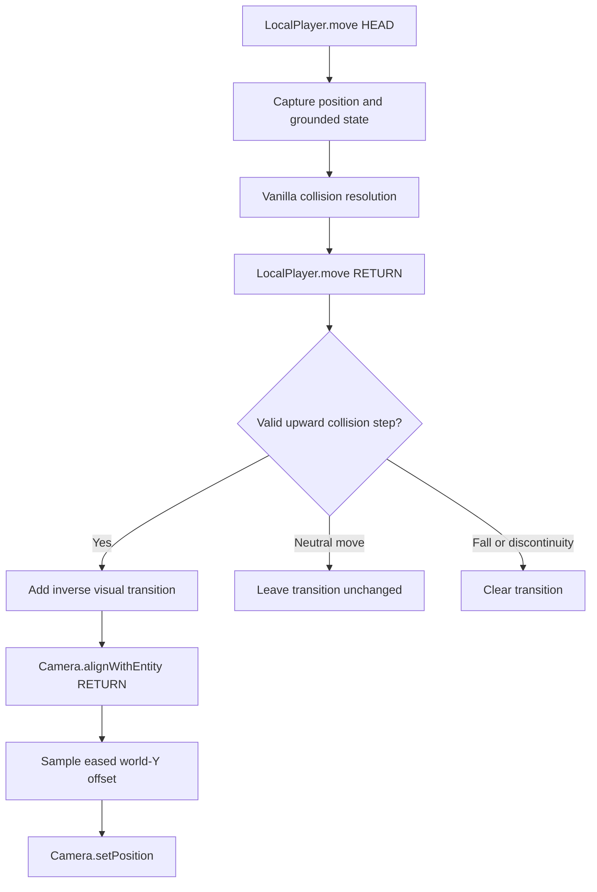

# Design

## Goals

1. Smooth camera motion caused by upward collision stepping.
2. Work with StepItUp's 1.25-block effective step height without calling its internal classes.
3. Leave gameplay state exactly unchanged.
4. Avoid hard runtime dependencies other than Minecraft and Fabric Loader.
5. Fail safely during invalid movement or context changes.

## Event flow

## Detection invariant

A movement is classified as an upward collision step only when all of these are true:

- The mover type is `SELF`.
- The local player was grounded when movement began and remained grounded after collision resolution.
- The player is alive and is not spectating, riding, sleeping, swimming, climbing, flying, or gliding.
- Requested vertical movement is not upward by more than the collision margin.
- Both requested and resolved horizontal movement are nonzero.
- The resolved rise is greater than 1/128 block.
- The resolved rise is greater than requested vertical movement plus 0.01 block.
- The resolved rise is no higher than the effective `maxUpStep()` value plus 1/16 block.

The effective step height is read after movement. This is intentional: StepItUp updates its transient step-height modifier at movement head, and same-priority mixin callback ordering is not treated as an API.

## Camera transition

For a step of height `h`, the visual offset starts at zero and mirrors the player interpolation during the first tick:

`offset(age) = -h * age`, for `0 <= age < 1 tick`.

The camera therefore stays near its pre-step world height while the entity interpolates upward. After the first tick, the negative offset eases to exactly zero over the configured recovery duration.

Each rapid step adds its own transition. Their sum is clamped to `maximum_camera_lag`, preventing an unbounded offset while preserving continuity on stairs.

## Camera hook

Minecraft 26.2 positions the camera in `Camera.alignWithEntity(float)`, which is called from `Camera.update(DeltaTracker)`. The mixin applies the correction at `alignWithEntity` return.

This point was selected because:

- first-person, mirrored camera, sleeping, minecart, and third-person placement have completed;
- frustum preparation has not yet run;
- calling `setPosition` updates both the precise position and internal block position;
- a world-Y adjustment stays vertical regardless of view pitch.

Direct field writes and camera-local `move` calls are deliberately avoided.

## State resets

The smoothing queue is cleared if the player or level instance changes, time moves backward, the camera focuses another entity, smoothing is disabled, the player leaves the ground, the player enters an excluded movement state, or the camera enters third person while third-person smoothing is disabled. The last resolved position is also compared before movement and camera sampling, so a same-player direct position correction or teleport clears the queue. This prevents a stale offset from surviving falls, respawn, dimension travel, spectator camera changes, mounts, unsupported perspective switches, or other discontinuities.

## Configuration screen

The optional Mod Menu screen exposes only `smoothing_strength` as a 0% to 100% Smoothness slider. Zero leaves the original upward camera motion unchanged, 50% applies half of the visual correction, and 100% applies the full correction. The default is 100%.

The screen edits a draft value. Cancel and Escape discard that draft. Reset changes the draft smoothness to its default without replacing recovery duration, easing, maximum lag, third-person behavior, or debug settings. Done writes a complete sanitized configuration through an atomic file replacement, publishes the new in-memory snapshot only after the write succeeds, and clears the active camera transition. The next eligible step therefore uses the new value immediately. A failed write leaves both the previous file and active configuration unchanged.

## Dependency boundary

The production jar has no compile-time or runtime link to StepItUp. Interoperability occurs only through vanilla movement and `maxUpStep()`. The optional StepItUp, Fabric API, and Cloth Config dependencies in Gradle are local-runtime fixtures for the compatibility client test and are never bundled.

Mod Menu is also optional. One isolated Fabric `modmenu` entrypoint implements its API, while the ordinary client entrypoint and smoothing code do not refer to Mod Menu classes. Fabric loads the integration class only when Mod Menu is installed. The API is compile-only, Mod Menu is a metadata suggestion, and no Mod Menu or Cloth Config code is packaged in this mod.
